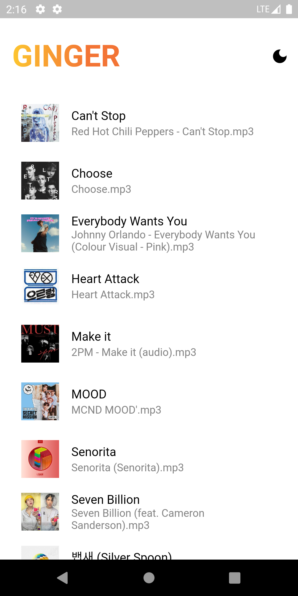
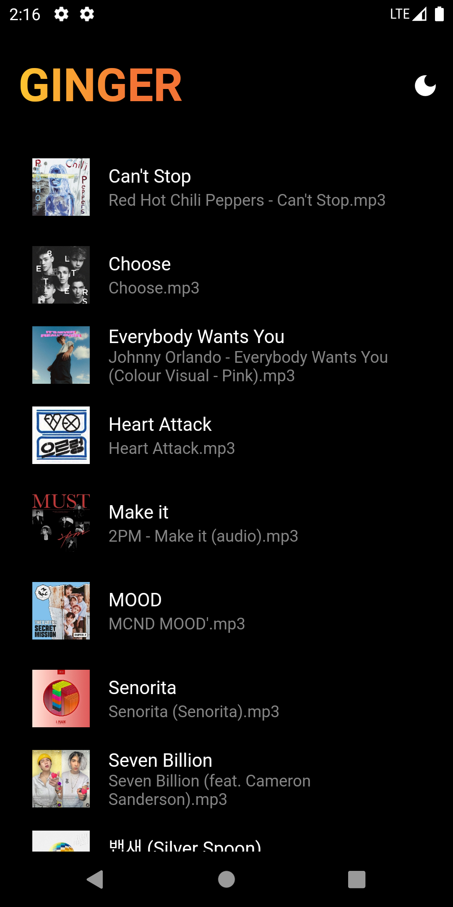

## Flutter Music Player 

This app plays offline music present on your device.

### Preview



### Dependencies
Dependencies used:
```bash
dependencies:
  audio_video_progress_bar: ^0.10.0
  just_audio: ^0.9.28
  on_audio_query: ^2.6.1
```


### Permission
To access local storage of your device for:
#### Android
Permission to be added in AndroidManifest.xml    
Path: ```android/app/src/main/AndroidManifest.xml```
```bash
<manifest xmlns:android="http://schemas.android.com/apk/res/android"
    package="com.example.project">

    <uses-permission android:name="android.permission.CAMERA" />
    <uses-permission android:name="android.permission.CALL_PHONE"/>
    <uses-permission android:name="android.permission.SYSTEM_ALERT_WINDOW"/>

 <application>...
```
#### IOS
Permission to be added in Info.plist  
Path: ```ios/Runner/Info.plist```
```bash
<key>NSPhotoLibraryUsageDescription</key>
<string>This app requires to save your images user gallery</string>
```

